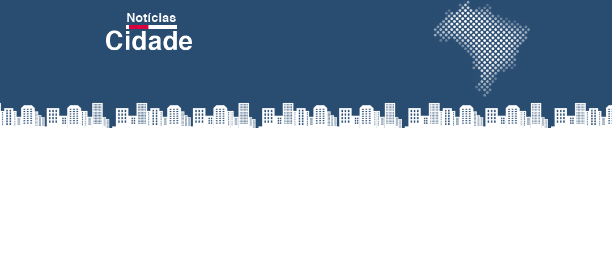
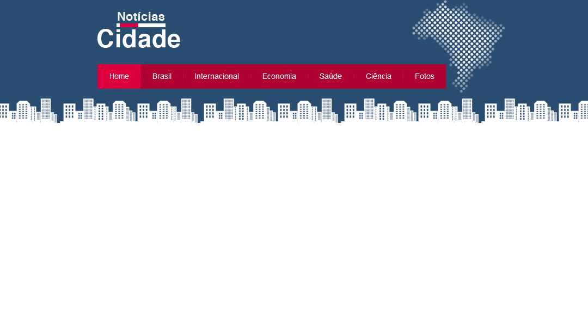
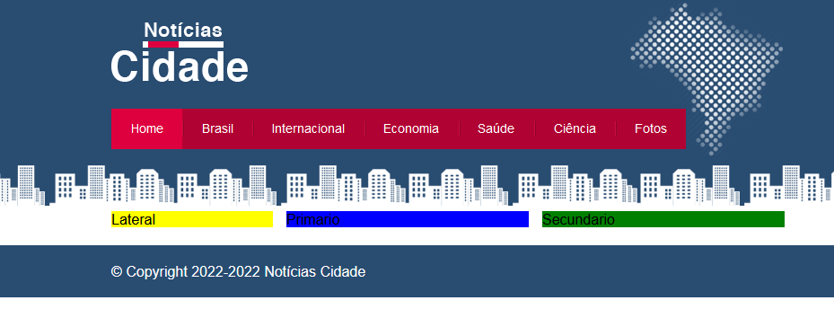
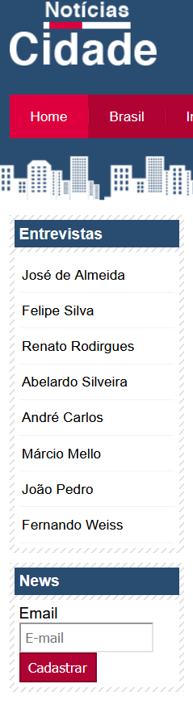

<h2 align="center">
Site Notícias da cidade
</h2>

Iremos criar um site Notícias da cidade modelo aonde atende os seu objetivos de seus acontecimentos
e suas informações

<h1 align="center">

<h2 align="center">
Barra de Navegaçao Horizontal
</h2>

Aqui iremos criar uma barra de navegação horizontal, onde será criada classes para controle no css
onde veremos formatação das fontes, background, ao passar o mouse, ao selecionar ao clicar na
página e assim mostrar em que página está.

<h1 align="center">

<h2 align="center">
Layout's em colunas + Rodapé
</h2>

Aqui vamos criar três colunas onde teremos à lateral, primário e secundario

<h1 align="center">

<h2 align="center">
Coluna esquerda formatada
</h2>

Foi separado div's, caixa, conteúdo e caixa de conteúdo, onde vai receber a nossa lista, de links entrevistas, abaixo caixa, caixa de conteudo para futuro cadastros.

<h1 align="center">

